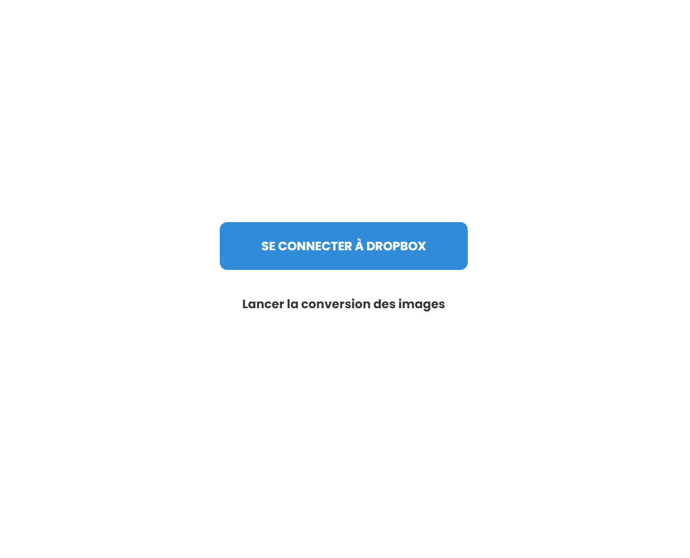

# ImgFilter-DropBox

ImgFilter-DropBox est une application web interactive qui applique des filtres en automatique sur des images et s'occupe ensuite du stockage et de la gestion via une application Dropbox.

## Fonctionnalités principales

- **Application de filtre sur image** avec phpimagefilters
- **Mise en stockage et gestion via dropbox** avec une application
- **Interface utilisateur intuitive** avec une esthétique moderne et simple 

## Prérequis

Pour commencer, rendez-vous sur le lien de création d'application dropbox : www.dropbox.com/developers/apps/create

Pour tester et utiliser cette application, vous devez disposer d'une **clé d'accès dropbox application**. Il vous faut renseigner les informations de connexion correspondant (APPKEY, APP SECRET, ACCESS TOKEN, REFRESH TOKEN) dans les fichiers suivants :

- image.php :

    • lignes 27, 71, 72

- header.php :

    • ligne 10

Pour tester et utiliser cette application, vous devez aussi disposer **de fichier défini sur votre espace dropbox**. Il vous faut renseigner les bons chemins vers les dossiers dans le fichier image.php aux lignes suivantes : 97, 281, 282, 287

## Technologies utilisées

- PHP
- CSS
- COMPOSER (dropbox, phpimagefilters)
- Stockage, Service et Application DROPBOX

## Captures d'écran

### État initial de l'application

## Installation et utilisation

[GitHub Pages](https://riskooooo.github.io/db-filter/)

1. Clonez ce dépôt sur votre machine locale
2. Ouvrez le fichier `index.php` dans votre navigateur
3. Lors de la première utilisation, entrez votre clé d'accès dropbox (prérequis !)
5. Cliquez sur "Lancer la conversion des images" pour recevoir lancer l'application des filtres sur vos images, puis après quelques secondes rendez-vous sur dropbox pour voir vos images après application

## Contribution

Les contributions à ce projet sont les bienvenues. N'hésitez pas à ouvrir une issue ou à soumettre une pull request.

## Licence

Ce projet est sous licence MIT, tous droits réservés.